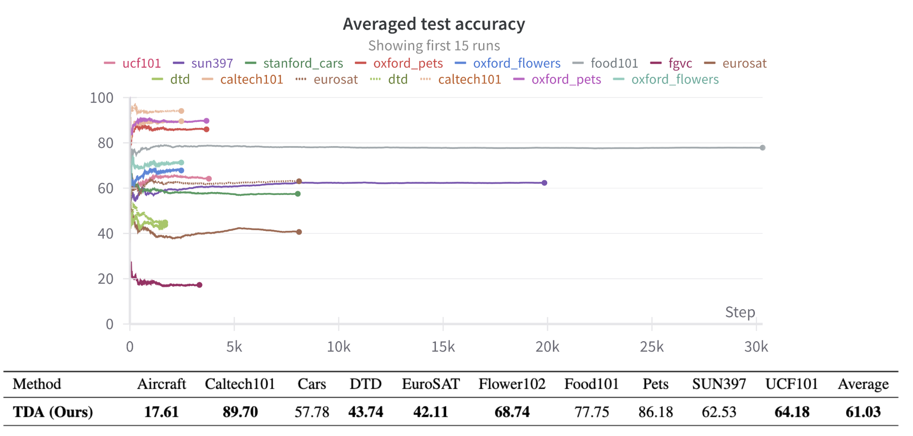
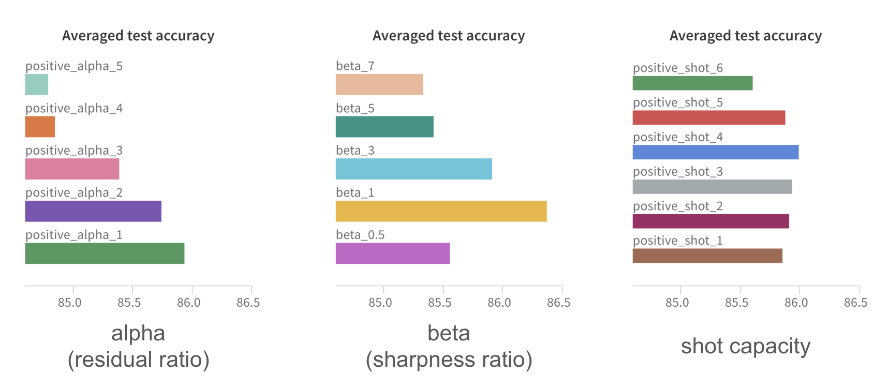
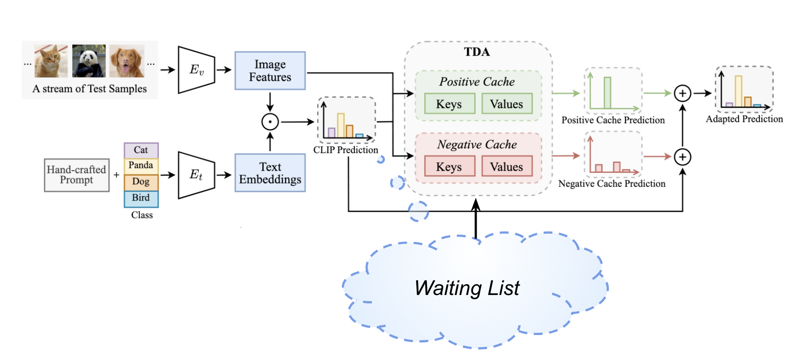

# Efficient TTA with Cache-based Dynamic Adapter (TDA)
> [**Efficient Test-Time Adaptation of Vision-Language Models**](http://arxiv.org/abs/2403.18293) 
> [Adilbek Karmanov](https://www.linkedin.com/in/adilbek-karmanov/), [Dayan Guan](https://dayan-guan.github.io/), [Shijian Lu](https://scholar.google.com/citations?hl=en&user=uYmK-A0AAAAJ&view=en), [Abdulmotaleb El Saddik](https://scholar.google.ca/citations?user=VcOjgngAAAAJ&hl=en), [Eric Xing](https://scholar.google.com/citations?user=5pKTRxEAAAAJ&hl=en)

Course-project for *"Trends and Applications in Computer Vision"* of prof. M. Mancini and G. Boato.

[Here](Final_presentation.pdf) you can find our **final presentation** for the results.

[Here](Related_Works.pdf) you can find the **related works** we studied.

by [Juan Camacho Mohedano](https://github.com/jucamohedano), [Andrea De Carlo](https://github.com/Dr3dre), [Samuele Bolotta](linkedin.com/in/samuele-bolotta-841b16160)

Please refer to the official [README](README_official.md) of the original project for the configuration of the original code.

## Our Contributions

What we did:

- Benchmark on different datasets, both OOD and [CD](tda_cd_benchmark.ipynb)
with failure cases on CIFAR-10-C (non-iid data stream) 
- We evaluated [how the performance changed w.r.t. changing hyperparameters](tda_runner_experiments.py) and the orders of data presented considering budget-aware constraints 

- We tried to mitigate the issues adding a [Waiting List](tda_runner_with_waiting.py) to the model, which improved performance on ImageNet but didn’t help on more challenging dataset like as CIFAR10-C 

You can find better details in the [final presentation](Final_presentation.pdf)

## file added:
- [tda_cd_benchmark.ipynb](tda_cd_benchmark.ipynb)
- [tda_runner_experiments.py](tda_runner_experiments.py)
- [tda_runner_with_waiting.py](tda_runner_with_waiting.py)